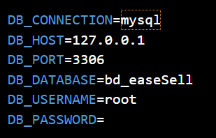

# TFG_DAW Alejandro Díaz Barea

## Enlaces proyecto desplegado

[Enlace para el backend](https://backenddpl-production.up.railway.app/)

[Enlace para el front](https://front-dpl-sm4q-git-main-ales-projects-3125483c.vercel.app/)

[Enlace figma](https://www.figma.com/design/pm1ixXHJoNlVaEwhdzCLwm/Untitled?node-id=0-1&t=iNo3V7dY5JkpZBwx-0)


## Despliegue proyecto en local


### 1º  Front

Para depslegar el front, necesitas hacer un git clone a mi front 

```javascript
git clone https://github.com/alejandro-diaz-barea/TFG_DAW
```

Luego se realiza el despliegue en local con :

```javascript
npm install
ng serve
```

### 2º Back

Para desplegar el backend, necesitas una vez clonado el proyecto realizar el comando en el archivo del backend esto : 

```javascript
compose install
```

Luego desplegar xampp y con eso modificar el .env del proyecto para la base de datos 



Luego ejecutar

```javascript
php artisan migrate
php artisan serve
```