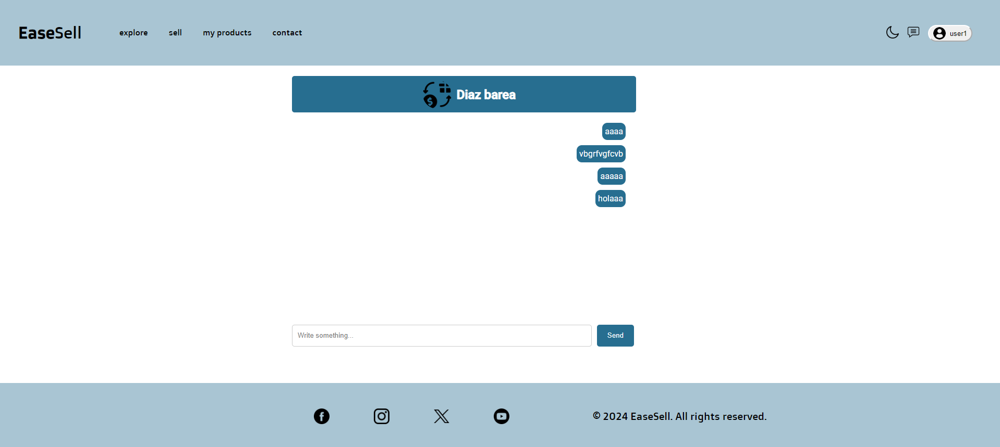

# 2ºDAW - Alejandro Díaz Barea

## EaseSell

## Índice

1. [Introducción](#1-introducción)
2. [Descripción](#2-descripción)
3. [Instalación y Preparación](#3-instalación-y-preparación)
   1. [Frontend](#31-frontend)
   2. [Backend](#32-backend)
4. [Guía de Estilos, Prototipado y Diseño](#4-guía-de-estilos-prototipado-y-diseño)
   1. [Guía de Estilos](#41-guía-de-estilos)
   2. [Diseño](#42-diseño)
5. [Desarrollo](#5-desarrollo)
6. [Manual para el Usuario](#6-manual-para-el-usuario)
   1. [Home](#61-home)
   2. [Registro](#62-registro)
   3. [Login](#63-login)
   4. [Perfil de Usuario](#64-perfil-de-usuario)
   5. [Página de Productos](#65-página-de-productos)
   6. [Vender Productos](#66-vender-productos)
   7. [Ver tus Productos y Poder Eliminarlos](#67-ver-tus-productos-y-poder-eliminarlos)
   8. [Página de Contacto](#68-página-de-contacto)
   9. [Ver Chats](#69-ver-chats)
   10. [Escribir Mensajes](#610-escribir-mensajes)
   11. [Administrador](#611-administrador)
7. [Despliegue](#7-despliegue)
8. [Conclusiones](#8-conclusiones)

## 1. Introducción

La idea de este proyecto surgió de crear una plataforma donde los usuarios puedan comprar y vender una amplia variedad de productos de manera fácil y segura, al mismo tiempo que tuvieran la posibilidad de comunicarse directamente con los vendedores a través de un sistema de chat integrado. Inspirado en plataformas como Vinted y otras aplicaciones de venta en línea, se buscó dar una experiencia intuitiva y atractiva para los usuarios que desean vender artículos de segunda mano o nuevos.

## 2. Descripción

La aplicación permite a los usuarios publicar productos en venta y establecer contacto con posibles compradores, así como comunicarse con ellos a través de una función de chat. Además, ofrece opciones de filtrado, búsqueda y ordenamiento para facilitar la navegación por la lista de productos, permitiendo a los usuarios encontrar lo que necesitan de manera eficiente.

Cuenta con un perfil personalizado que permite a los usuarios gestionar su información y cambiar su foto de perfil según sus preferencias. También ofrece un menú donde pueden gestionar sus productos, permitiendo eliminar aquellos que ya han sido vendidos.

Además, la aplicación cuenta con un modo de administrador que brinda funciones adicionales, como la capacidad de eliminar productos y la capacidad de gestionar usuarios, incluyendo la posibilidad de banear usuarios o cambiar su rol de usuario a administrador y viceversa.

En términos de diseño, se ha puesto un énfasis especial en la interfaz de usuario para garantizar que sea intuitiva y cómoda para los clientes, con el objetivo de ofrecer una experiencia de usuario satisfactoria y fácil de usar.

## 3. Instalación y Preparación

### 3.1. Frontend

Para depslegar el front, necesitas hacer un git clone a mi front 

```javascript
git clone https://github.com/alejandro-diaz-barea/TFG_DAW
```

Luego se realiza el despliegue en local con :

```javascript
npm install
ng serve
```


### 3.2. Backend

Para desplegar el backend, necesitas una vez clonado el proyecto realizar el comando en el archivo del backend esto : 

```javascript
compose install
```

Luego desplegar xampp y con eso modificar el .env del proyecto para la base de datos 


Luego ejecutar

```javascript
php artisan migrate
php artisan serve
```

## 4. Guía de Estilos, Prototipado y Diseño

### 4.1. Guía de Estilos

Para la aplicación, decidí usar tonos claros como el blanco y el azul, con los cuales he jugado un poco con la gama del azul, ya que me parecían colores agradables a la vista y que permitirían una mayor concentración en el producto.


### 4.2. Diseño


## 5. Desarrollo

En cuanto al desarrollo, se comenzó con los controles de usuario, seguido por la visualización de todos los productos, y finalmente se implementaron el modo administrador y la mensajería. La mayor dificultad encontrada fue la mensajería y la gestión del tiempo debido a las prácticas.

Para el control de versiones, he utilizado GitHub. En el frontend, he empleado Angular, y para el backend, he usado Laravel con una base de datos en MySQL.

## 6. Manual para el Usuario

Para este apartado lo voy a dividir por apartados, según las partes de la web:

### 6.1. Home

La página del home consiste en una breve introducción a lo que consiste la página web, con un botón para empezar a ver productos.


### 6.2. Registro

Para el registro, pide varios campos como son: el correo, la contraseña repetida dos veces, el nombre, la dirección, el número de teléfono y un checkbox para aceptar las condiciones.


El cual controla que no se pueda enviar ningún campo vacío, ni el checkbox sin marcar, además mediante el backend te dice si el número de teléfono o el email ya lo tiene otro usuario registrado.


### 6.3. Login

Para el login en la aplicación se hace más sencillo, con un fetch al backend el cual te devuelve el token y más campos importantes del usuario y lo guardo en el script para futuras cosas.


Cuando el usuario está baneado, lo pone en un mensaje y el usuario podrá escribir en el contacto para pedir reclamaciones.


### 6.4. Perfil de Usuario

En cuanto al perfil de usuario, puedes cambiar tu foto de perfil pinchando en la que tienes por defecto. También puedes cambiar el nombre del usuario y su dirección.


### 6.5. Página de Productos

En la página de productos nos encontramos con un buscador, un filtro aplicable mediante un pop-up y un selector para ordenar por precio o por nombre.


Esta página permite una depuración de búsqueda intuitiva y que facilita la utilización del usuario. Además, tiene una paginación para no sobrecargar la página de productos.


### 6.6. Vender Productos

Para vender productos se usa una interfaz muy fácil e intuitiva en la cual poner el título, la descripción, el precio, los filtros para ponerle a la búsqueda y el drag and drop, lo cual puedes añadir y borrar imágenes para poner la que más te guste.


### 6.7. Ver tus Productos y Poder Eliminarlos

En esta sección puedes ver tus propios productos y tener la posibilidad de eliminarlos si ya lo has vendido a un comprador o en caso de no gustarte cómo quedan. El proceso es sencillo: le das al botón de eliminar y te sale un pop-up para confirmar la eliminación y se borra el producto.


### 6.8. Página de Contacto

Este apartado es simple, rellenas unos campos sobre una incidencia o una propuesta de mejora y lo envías para poder tener un feedback de la aplicación.


### 6.9. Ver Chats

Una vez que en explorar productos le des a contactar con el comprador, te enviará a tus chats con el nuevo comprador para charlar con él pulsando en su chat.


### 6.10. Escribir Mensajes

Mediante Pusher se puede mandar mensajes en tiempo real en la aplicación. En cuanto al despliegue público no se me ha aplicado esto, pero en local funciona perfectamente, lo cual es un chat simple.



### 6.11. Administrador

El administrador tiene poderes para hacer de todo en la web. Una cosa es poder borrar todos los productos, y otra es poder banear y cambiar el rol a los usuarios de la plataforma.

Aquí pueden ver cómo maneja a los usuarios:


Aquí como veis puede borrar todos los productos:

<

## 7. Despliegue

Para el despliegue en el frontend he elegido Vercel, ya que es una página que poniendo el repositorio se sube solo y es bastante cómodo.

[Enlace para el front](https://front-dpl-sm4q-git-main-ales-projects-3125483c.vercel.app/)

Para el backend he escogido Railway, ya que es otro lugar muy cómodo y tiene una prueba gratuita la cual se hace muy cómoda de utilizar porque con dos botones tienes levantado una base de datos y el proyecto sin necesidad de Docker.

[Enlace para el backend](https://backenddpl-production.up.railway.app/)

## 8. Conclusiones

Respecto a cómo planteé el proyecto, considero que lo he mejorado con la implementación del modo administrador y la capacidad de subir una foto de perfil. Las mejoras a realizar incluyen la posibilidad de editar los productos, ya que esta funcionalidad fue complicada de implementar y no pude completarla, así como un mejor filtrado de los productos y una mensajería para confirmar que el registro se realizó con la cuenta correcta.

